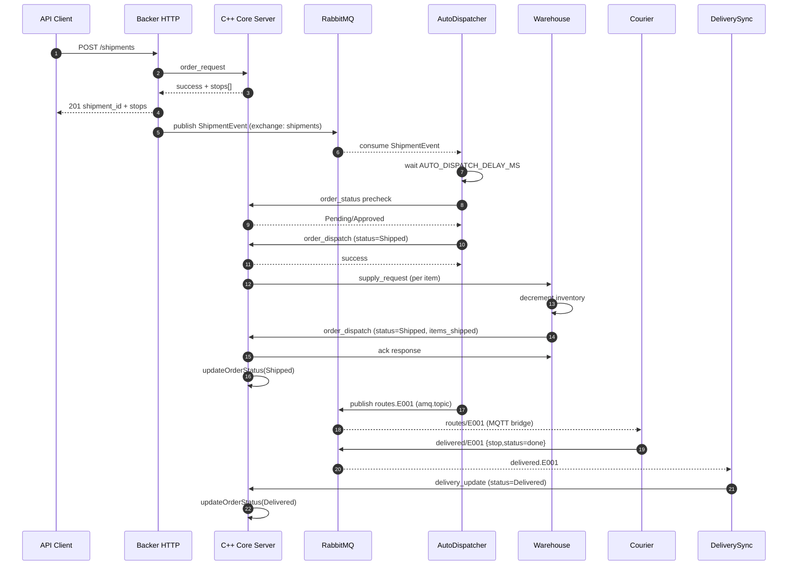
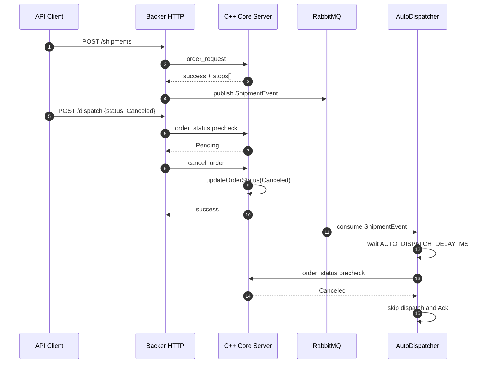
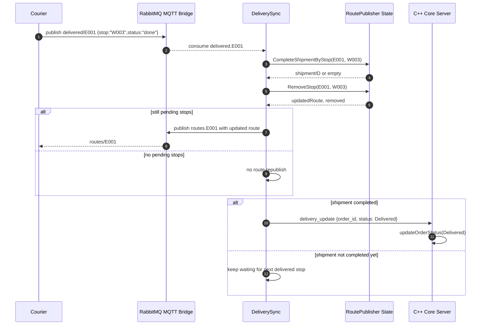
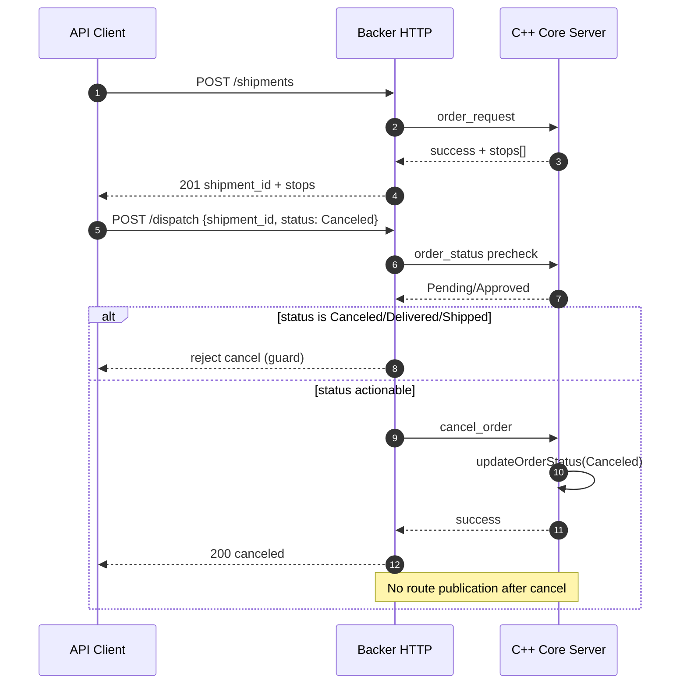

# Complete System Flow (Implementation-Mapped)

This document maps the end-to-end system flow to concrete source files, methods, and message producers/consumers.

## 1. Services and Their Entry Points

- Backer (Go HTTP + RabbitMQ workers)
  - `backer/src/cmd/main.go`
  - HTTP handlers: `backer/src/internal/handlers/shipments.go`
  - Rabbit workers:
    - `backer/src/internal/worker/auto_dispatch.go`
    - `backer/src/internal/worker/delivery_sync.go`

- Core Server (C++ TCP + HTTP graph API)
  - Process entry: `server/src/main.cpp`
  - TCP server loop: `server/src/server.cpp`
  - TCP request routing: `server/src/request_router.cpp`
  - Order lifecycle: `server/src/orders.cpp`
  - Inventory persistence: `server/src/inventory.cpp`
  - Client registration/auth: `server/src/authentication.cpp`

- Hub client (C)
  - Process entry and menu: `hub/src/main.c`
  - Outgoing order messages: `hub/src/orders.c`
  - Incoming distribution updates: `hub/src/listener.c`

- Warehouse client (C)
  - Process entry and menu: `warehouse/src/main.c`
  - Incoming supply requests: `warehouse/src/listener.c`
  - Outgoing order dispatch ack: `warehouse/src/orders.c`
  - Outgoing inventory/restock updates: `warehouse/src/inventory.c`

- Courier device/simulator (C/C++)
  - Device startup: `courier/src/main.c`
  - MQTT subscribe/publish handlers: `courier/src/mqtt_handler.c`
  - Simulator entry: `courier/sim/main_sim.cpp`

## 2. Startup and Registration Flow

### 2.1 Backer startup

1. `main()` in `backer/src/cmd/main.go` builds:
- C++ bridge client (`bridge.NewCppClient`)
- Rabbit producer (`mq.NewProducer`)
- Route publisher (`mq.NewRoutePublisher`)
- Optional auto-dispatch worker (`worker.StartAutoDispatcher`)
- Delivery-sync worker (`worker.StartDeliverySyncWorker`)
- HTTP endpoints (`/shipments`, `/status/{id}`, `/dispatch`, etc.)

### 2.2 Server startup

1. `main()` in `server/src/main.cpp` creates shared instances:
- `Authentication`
- `InventoryManager`
- `OrderManager`
- `RequestRouter`
- `Server`
2. `Server::run()` in `server/src/server.cpp` accepts TCP clients and dispatches each JSON request via `router_.routeRequest(...)`.
3. `Server::run()` also launches `orderManager_.processApprovedOrders()` in a background thread.

### 2.3 Hub and Warehouse registration

1. Hub builds and sends `client_info` from:
- `create_client_info_hub(...)` in `hub/src/authentication.c`
- Called from `hub/src/main.c`
2. Warehouse builds and sends `client_info` from:
- `create_client_info_warehouse(...)` in `warehouse/src/authentication.c`
- Called from `warehouse/src/main.c`
3. Server consumes both in:
- `Authentication::processClientInfo(...)` in `server/src/authentication.cpp`
- Stores node/user data, connection edges, and refreshes graph snapshot.

## 3. Main Order Lifecycle (End-to-End)

## 3.1 Shipment creation (HTTP -> Backer -> C++ core)

1. Client calls `POST /shipments`.
2. Backer handles request in `CreateShipment(...)` (`backer/src/internal/handlers/shipments.go`):
- Validates body.
- Generates `shipment_id`.
- Sends TCP JSON `order_request` through `CppClient.SendRequest(...)` (`backer/src/internal/bridge/cpp_client.go`).
3. Server routes `type=order_request` in `RequestRouter::routeRequest(...)` (`server/src/request_router.cpp`) to:
- `OrderManager::handleNewOrder(...)` (`server/src/orders.cpp`).
4. `handleNewOrder(...)`:
- Stores requested items in DB.
- Computes candidate warehouse stops via `inventoryManager.findWarehouseForItem(...)`.
- Returns JSON with `status=success`, `order_id`, and `stops[]`.
5. Backer returns HTTP 201 with `shipment_id`, `status=pending`, `stops[]`.
6. Backer asynchronously publishes `ShipmentEvent` to RabbitMQ exchange `shipments` using `Producer.Publish(...)` (`backer/src/internal/mq/producer.go`).

## 3.2 Auto-dispatch branch (RabbitMQ -> Backer worker -> C++ core)

1. `AutoDispatcher` (`backer/src/internal/worker/auto_dispatch.go`) consumes from queue `backer.auto_dispatch` bound to `shipments` fanout exchange.
2. It validates payload and waits `AUTO_DISPATCH_DELAY_MS`.
3. It prechecks current core status using `order_status` via C++ bridge.
4. If allowed, it sends `order_dispatch` with `status=Shipped` to C++ core.
5. It appends stops to route queue with `RoutePublisher.AppendStops(...)`.
6. It registers shipment-stop completion tracking with `RoutePublisher.RegisterShipmentStops(...)`.
7. It publishes the full courier route via `RoutePublisher.PublishRoute(...)` to `amq.topic` key `routes.{employee_id}`.

## 3.3 Manual dispatch/cancel branch (HTTP /dispatch)

Handled in `Dispatch(...)` (`backer/src/internal/handlers/shipments.go`):

- For `status=Canceled`:
  - Sends `cancel_order` to C++ core.

- For `status=Shipped`:
  - Requires `employee_id` and `stops[]`.
  - Sends `order_dispatch` with `status=Shipped` to C++ core.
  - Appends/publishes route using the same route publisher path as auto-dispatch.

Both branches use status precheck (`order_status`) before dispatch/cancel to avoid invalid transitions.

## 3.4 Server to warehouse fulfillment

1. Approved orders are polled in `OrderManager::processApprovedOrders()` (`server/src/orders.cpp`).
2. For each approved order, `supplyRequest(...)` is called.
3. `supplyRequest(...)` resolves warehouse by item and sends per-item `supply_request` JSON via:
- `sender.sendMessageToClient(warehouseId, payload)`.
4. Warehouse consumes `supply_request` in `listen_for_request(...)` (`warehouse/src/listener.c`):
- Decrements local inventory (`update_inventory(..., -quantity)`).
- Optionally emits `restock_notice`.
- Sends back `order_dispatch` using `send_orderdispatch_to_server(...)` (`warehouse/src/orders.c`) with `status=Shipped` and `items_shipped`.
- Sends full `inventory_update` (`send_inventory_to_server(...)`, `warehouse/src/inventory.c`).

## 3.5 Server order status transition and hub notification

1. Server receives warehouse `order_dispatch` and routes it to:
- `OrderManager::handleOrderDispatch(...)` (`server/src/orders.cpp`).
2. `handleOrderDispatch(...)`:
- Guards terminal states (e.g., ignores `Canceled`/`Delivered` override).
- Builds `order_for_distribution` payload.
- Sends it to hub via `sender.sendMessageToClient(hubId, ...)`.
- Updates order status in DB.
3. Hub consumes `order_for_distribution` in `listen_for_updates(...)` (`hub/src/listener.c`).

## 3.6 Courier route and delivery completion

1. Courier subscribes to `routes/{employee_id}` in `mqtt_handler_subscribe_routes()` (`courier/src/mqtt_handler.c`), started from `courier/src/main.c`.
2. Backer publishes routes to RabbitMQ `amq.topic` as `routes.{employee_id}` (`RoutePublisher.PublishRoute`); RabbitMQ MQTT plugin maps dot-routing to MQTT slash topic.
3. Courier presses Delivered button:
- publishes `delivered/{employee_id}` with payload `{"stop":"...","status":"done"}` via `mqtt_handler_publish_delivered(...)`.
4. Backer `DeliverySyncWorker` consumes `delivered.*` from `amq.topic`:
- resolves employee from routing key,
- removes stop from route queue (`RemoveStop`),
- checks shipment completion (`CompleteShipmentByStop`),
- if shipment completes, sends C++ `delivery_update` with `status=Delivered`.
5. Server routes `delivery_update` to `OrderManager::deliveryUpdate(...)`, which updates order status to Delivered.

## 4. Status Query and Cancellation Flow

- Status query:
  - Backer `GET /status/{id}` -> C++ `order_status` -> `OrderManager::handleOrderStatusQuery(...)`.

- Cancellation:
  - Backer `POST /dispatch` with `status=Canceled` -> C++ `cancel_order` -> `OrderManager::handleCancelation(...)`.

## 5. Message and Topic Matrix (Producer -> Consumer)

| Message / Topic | Producer (file::method) | Transport | Consumer (file::method) | Effect |
|---|---|---|---|---|
| `client_info` | `hub/src/authentication.c::create_client_info_hub`, `warehouse/src/authentication.c::create_client_info_warehouse` | TCP JSON | `server/src/authentication.cpp::Authentication::processClientInfo` | Register client, store coordinates/connections, refresh graph |
| `order_request` | `backer/src/internal/handlers/shipments.go::CreateShipment` (through C++ bridge) OR `hub/src/orders.c::create_order_request` | TCP JSON | `server/src/orders.cpp::OrderManager::handleNewOrder` | Persist order items, compute stops, return order response |
| `shipments` exchange event | `backer/src/internal/mq/producer.go::Producer.Publish` | RabbitMQ fanout | `backer/src/internal/worker/auto_dispatch.go::AutoDispatcher` | Trigger delayed auto-dispatch |
| `order_dispatch` | `backer/src/internal/handlers/shipments.go::Dispatch` (manual) OR `warehouse/src/orders.c::send_orderdispatch_to_server` | TCP JSON | `server/src/orders.cpp::OrderManager::handleOrderDispatch` | Notify hub, transition status to Shipped |
| `cancel_order` | `backer/src/internal/handlers/shipments.go::Dispatch` | TCP JSON | `server/src/orders.cpp::OrderManager::handleCancelation` | Transition status to Canceled (if allowed) |
| `supply_request` | `server/src/orders.cpp::OrderManager::supplyRequest` | TCP JSON | `warehouse/src/listener.c::listen_for_request` | Warehouse fulfills request and decrements inventory |
| `inventory_update` | `warehouse/src/inventory.c::send_inventory_to_server` | TCP JSON | `server/src/inventory.cpp::InventoryManager::handleInventoryUpdate` | Persist current stock |
| `restock_notice` | `warehouse/src/inventory.c::send_restock_to_server` | TCP JSON | `server/src/inventory.cpp::InventoryManager::handleRestockNotice` | Persist restock and refresh graph |
| `order_for_distribution` | `server/src/orders.cpp::OrderManager::handleOrderDispatch` | TCP JSON | `hub/src/listener.c::listen_for_updates` | Hub receives shipment status and item list |
| `routes.{employee}` (`routes/{employee}` in MQTT) | `backer/src/internal/mq/route_publisher.go::PublishRoute` | RabbitMQ topic (MQTT bridge) | `courier/src/mqtt_handler.c::mqtt_handler_subscribe_routes` | Courier receives full current route |
| `delivered/{employee}` (`delivered.{employee}` in AMQP) | `courier/src/mqtt_handler.c::mqtt_handler_publish_delivered` | MQTT (bridged to AMQP topic) | `backer/src/internal/worker/delivery_sync.go::handleDeliveredEvent` | Remove stop from route queue; on completion send `delivery_update` |
| `delivery_update` | `backer/src/internal/worker/delivery_sync.go::handleDeliveredEvent` | TCP JSON | `server/src/orders.cpp::OrderManager::deliveryUpdate` | Final status transition to Delivered |
| `tracking/{employee}` | `courier/src/mqtt_handler.c::mqtt_handler_publish_tracking` | MQTT | Observability consumers (dashboard/subscribers) | Live courier position stream |
| `alerts/sos/{employee}` | `courier/src/mqtt_handler.c::mqtt_handler_publish_sos` | MQTT | Alert subscribers | SOS event for incident handling |

## 6. Notes on Responsibility Boundaries

- Backer is orchestration/API + asynchronous workflow glue (HTTP, RabbitMQ workers, route publication, delivery reconciliation).
- C++ server is source of truth for order/inventory state transitions and hub/warehouse TCP interactions.
- Warehouse performs physical fulfillment simulation and reports dispatch + inventory updates.
- Courier owns field events (`tracking`, `sos`, `delivered`) and route progression UI.
- Hub is requester/observer of order lifecycle updates.

## 7. Quick Index of Most Important Methods

- Backer HTTP:
  - `CreateShipment`, `Dispatch`, `GetStatus` in `backer/src/internal/handlers/shipments.go`
- Backer workers:
  - `StartAutoDispatcher`, `handleMessage` in `backer/src/internal/worker/auto_dispatch.go`
  - `StartDeliverySyncWorker`, `handleDeliveredEvent` in `backer/src/internal/worker/delivery_sync.go`
- Backer route engine:
  - `AppendStops`, `RegisterShipmentStops`, `CompleteShipmentByStop`, `RemoveStop`, `PublishRoute` in `backer/src/internal/mq/route_publisher.go`
- Core server routing:
  - `RequestRouter::routeRequest` in `server/src/request_router.cpp`
- Core order lifecycle:
  - `handleNewOrder`, `processApprovedOrders`, `supplyRequest`, `handleOrderDispatch`, `handleCancelation`, `deliveryUpdate`, `handleOrderStatusQuery` in `server/src/orders.cpp`
- Warehouse:
  - `listen_for_request` in `warehouse/src/listener.c`
  - `send_orderdispatch_to_server` in `warehouse/src/orders.c`
  - `send_inventory_to_server`, `send_restock_to_server` in `warehouse/src/inventory.c`
- Hub:
  - `create_order_request`, `handle_cancel_order`, `handle_query_order_status`, `handle_delivery_update` in `hub/src/orders.c`
  - `listen_for_updates` in `hub/src/listener.c`
- Courier:
  - `mqtt_handler_subscribe_routes`, `mqtt_handler_publish_delivered`, `mqtt_handler_publish_tracking`, `mqtt_handler_publish_sos` in `courier/src/mqtt_handler.c`

## 8. Protocol Payload Contracts (Most Used)

These are the most relevant payload shapes as implemented in code.

### 8.1 Backer -> C++: order_request

Producer:
- `backer/src/internal/handlers/shipments.go::CreateShipment`

Shape:
```json
{
  "type": "order_request",
  "hub_id": "H001",
  "order_id": "SHP1776297196403",
  "items_needed": [
    {"item_type": 1, "quantity": 10},
    {"item_type": 2, "quantity": 3}
  ]
}
```

### 8.2 C++ -> Backer: order_request response

Consumer:
- `backer/src/internal/handlers/shipments.go::CreateShipment`

Shape:
```json
{
  "status": "success",
  "order_id": "SHP1776297196403",
  "stops": ["W003", "W007"]
}
```

### 8.3 Backer -> RabbitMQ fanout: shipments event

Producer:
- `backer/src/internal/mq/producer.go::Publish`

Exchange:
- `shipments` (fanout)

Shape:
```json
{
  "shipment_id": "SHP1776297196403",
  "hub_id": "H001",
  "stops": ["W003", "W007"],
  "items": [
    {"item_type": 1, "quantity": 10},
    {"item_type": 2, "quantity": 3}
  ],
  "timestamp": "2026-04-15T12:00:00Z"
}
```

### 8.4 Backer/warehouse -> C++: order_dispatch

Backer producer:
- `backer/src/internal/handlers/shipments.go::Dispatch`
- `backer/src/internal/worker/auto_dispatch.go::handleMessage`

Warehouse producer:
- `warehouse/src/orders.c::send_orderdispatch_to_server`

Shape:
```json
{
  "type": "order_dispatch",
  "order_id": "SHP1776297196403",
  "status": "Shipped",
  "items_shipped": [
    {"item_type": 1, "quantity": 10, "fulfilled_by": "W003"}
  ],
  "timestamp": "2026-04-15T12:00:10Z"
}
```

### 8.5 Warehouse <- C++: supply_request

Producer:
- `server/src/orders.cpp::OrderManager::supplyRequest`

Consumer:
- `warehouse/src/listener.c::listen_for_request`

Shape:
```json
{
  "type": "supply_request",
  "timestamp": "2026-04-15T12:00:05Z",
  "order_id": "SHP1776297196403",
  "items_needed": [
    {"item_type": 1, "quantity": 10, "fulfilled_by": "W003"}
  ]
}
```

### 8.6 Backer -> RabbitMQ topic: routes.employee

Producer:
- `backer/src/internal/mq/route_publisher.go::PublishRoute`

Exchange/key:
- Exchange: `amq.topic`
- Routing key: `routes.E001`

MQTT bridge topic:
- `routes/E001`

Payload:
```json
["W003", "W007", "H001"]
```

### 8.7 Courier -> MQTT: delivered/employee

Producer:
- `courier/src/mqtt_handler.c::mqtt_handler_publish_delivered`

Topic/payload:
```json
Topic: delivered/E001
Payload: {"stop":"W003","status":"done"}
```

AMQP bridge routing key consumed by Backer:
- `delivered.E001`

### 8.8 Backer -> C++: delivery_update

Producer:
- `backer/src/internal/worker/delivery_sync.go::handleDeliveredEvent`

Shape:
```json
{
  "type": "delivery_update",
  "timestamp": "2026-04-15T12:04:30Z",
  "hub_id": "backer",
  "order_id": "SHP1776297196403",
  "status": "Delivered"
}
```

## 9. Decision and Ack Semantics

### 9.1 Dispatch guards (Backer)

Location:
- `backer/src/internal/handlers/shipments.go::Dispatch`
- `backer/src/internal/worker/auto_dispatch.go::handleMessage`

Rules:
- Performs `order_status` precheck before dispatch.
- If status is `Canceled`, `Delivered`, or `Shipped`, dispatch is skipped/rejected.
- Prevents cancel-vs-ship race and duplicate route publication.

### 9.2 Dispatch guards (C++ core)

Location:
- `server/src/orders.cpp::OrderManager::handleOrderDispatch`

Rules:
- Ignores illegal terminal overrides (`Canceled`/`Delivered` -> `Shipped`).
- Ignores idempotent duplicate `Shipped` updates.

### 9.3 Queue ack behavior (Backer workers)

Auto-dispatch (`backer/src/internal/worker/auto_dispatch.go`):
- Invalid payload or non-actionable shipment: `Ack`.
- Transient bridge/publish failures: `Nack(requeue=true)`.
- Final skip condition (already finalized): `Ack`.

Delivery sync (`backer/src/internal/worker/delivery_sync.go`):
- Invalid payload/routing/non-done statuses: `Ack`.
- Remove-stop or publish failures: logs warning and `Ack` (does not poison-loop).

### 9.4 Status authority

- Final order state authority remains C++ core DB updates in:
  - `server/src/orders.cpp::updateOrderStatus`
- Backer orchestrates transitions by sending typed requests, but does not own persisted order state.

## 10. Sequence Diagrams

These diagrams summarize the three most important runtime paths.

### 10.1 Auto-dispatch happy path



### 10.2 Cancel-before-dispatch path



### 10.3 Delivered-completion path



### 10.4 Manual-cancel path (auto-dispatch disabled or bypassed)


